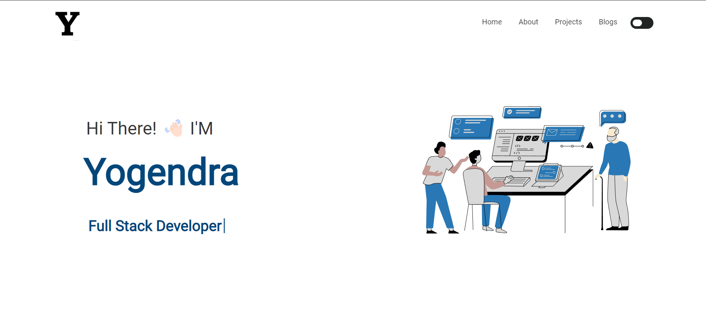

<h2 align="center">
  Yogendra Pandey | Portfolio Website 
</h2>

  

 

This project is built using these technologies.

- React.js
- CSS3
- VsCode
- Vercel

## Features

**Multi-Page Layout**

**Styled with React-Bootstrap and Css**

**Fully Responsive**

**Dark and Light Theme**

## Getting Started

Clone this repository. You will need `node.js` and `git` installed globally on your machine.

## 🛠 Installation and Setup Instructions

1. Installation: `npm install`

2. In the project directory, you can run: `npm start`

Runs the app in the development mode.\
Open [http://localhost:3000](http://localhost:3000) to view it in the browser.
The page will reload if you make edits.